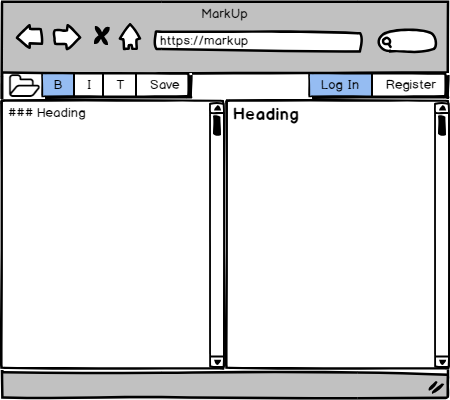

# Требования к проекту
### Содержание
1. [Введение](#1)
2. [Требования пользователя](#2)  
  2.1. [Программные интерфейсы](#2.1)  
  2.2. [Интерфейс пользователя](#2.2)  
  2.3. [Характеристики пользователей](#2.3)  
  2.4. [Предположения и зависимости](#2.4)  
3. [Системные требования](#3)  
  3.1 [Функциональные требования](#3.1)  
  3.2 [Нефункциональные требования](#3.2)  
4. [Аналоги](#4)  

[Тестовый план](result.md)

### Глоссарий
* Шаринг файлов - возможность доступа пользователя к файлам другого пользователя.

### 1. Введение 
Markup - текстовый редактор с поддержкой Markdown разметки. Markdown является простым языком форматирования текста, который легко можно преобразовать в HTML или RICHTEXT формат.
Основной целью данного проетка является создание комплексного сервиса для редактирования и безопасного хранения Markdown файлов.
Под редактированием понимается изменение текста и применение возможностей форматирования языка Markdown. 
Редактирования шрифтов, размера текста, цвета не предусмотрено.

### 2. Требования пользователя 
#### 2.1. Программные интерфейсы 
Проект является web приложением c архитектурой REST API. Основу серверной части составляет Django и djangorest фреймворки.
Клиентская часть основывается на Angular фреймворке. База данных PostgeSQL. 

#### 2.2. Интерфейс пользователя 

Основное окно 

#### 2.3. Характеристики пользователей 
Для использования клиентской части достаточно базовых умений обращения с компьютером и базовое знание языка Markdown.
Данных пользователей можно разделить на:
* Пользователи, которым необходим текстовый редактор Markdown разметки
* Пользователи, которым необходима возможность хранения текстовых файлов.
* Пользователи, которым необходима возможность шаринга файлов.

Другой тип пользователей - продвинутые пользователи, имеющие знания в области WEB разработки и REST API, 
которые будут общаться  с ПО посредствам REST API, не задейтсвуя клиентскую часть ПО.

#### 2.4. Предположения и зависимости 
Для работы клиента с ПО необходимо подключение к сети Интернет и браузер. Владелец ПО в свою очередь обязан 
постоянно держать в рабочем состоянии сервер и  базу данных. В случае отключения сервера ПО прекращает свое работу.

### 3. Системные требования 
#### 3.1. Функциональные требования 
Пользовательские возможности предоставленные в таблице.

Функция | Требования
--- | ---
Редактирование текста | Приложение должно давать возможность вводить и удалять символы в браузере
Отображение форматированного текста | Приложение должно отображать введенный текст в читабельном формате
Скачивание введенного текста в исходном виде | Приложение дает возможность скачать файл в Markdown формате 
Скачивание введенного текста в HTML формате | Приложение дает возможность скачать файл в HTML формате
Регистрация на сайте | Пользователь может зарегистрировать аккаунт с помощью почты
Авторизация на сайте | Пользователь может авторизировться в системе
Возможность смены пароля | Пользоваетель может сменить пароль, авторизовавшись в системе
Возможность сброса пароля | Пользователь может сбросить пароль, используя привязвнную к аккаунту почту
Возможность смены полного имени | Пользоваетль может изменить свое полное имя, авторизовавшись в системе
Возможность установки аватара | Пользователь может загрузить фото своего профиля 
Сохранение файла на сервере | Сохранение введенного тескта на авторизированном аккаунте
Шаринг файлов в режиме только чтение | Пользователь может дать возможность просмотра своего файла другому пользователю
Шаринг файлов в режиме только чтение и запись | Пользователь может дать возможность просмотра и редактирования своего файла другому пользователю

#### 3.2. Нефункциональные требования 
##### 3.2.1 Атрибуты качества
* Простота графического интерфейса - два рабочих окна: основное окно и окно профиля пользователя.
* Безопасность доступа - пользователи имеют доступ только к своим файлам и файлам, к которым имеют доступ.
* Безопасность хранения - хранение файлов в зашифрованном виде.

##### 3.2.2 Внешние интерфейсы
* Использование Rest архитектуры
  
### 4. Аналоги 
* Notepad - прямой аналог основной функциональности. Отсутствует возможность просмотра Markdown текста 
в конечном виде. Не поддерживает возможность запуска в веб-браузере.
* Markdown Editor - расширения для Visual Studio. Основной недостаток - необходимость установки Visual Studio.
* StackEdit - браузерный редактор текста с возможностью хранения текстовых файлов. Основной недостаток - остутсвие мер безопасного хранения.